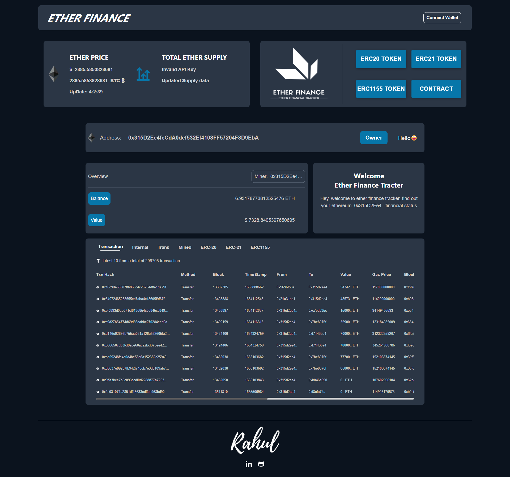

# Etherscan [🔗](https://etherscan-eta.vercel.app/)

## Overview
The Web 3.0 Etherscan Project is an advanced web application designed to harness the power of modern web3 technologies, including Infura, Ether.js, and Web3Modal, alongside React for building user interfaces. This project exemplifies best practices in web3 development, such as a well-organized React file structure and efficient state management using the Context API. It also demonstrates three distinct methods for API integration: Fetch API, Etherscan Global API, and Axios, providing a comprehensive learning experience.

## Technologies Used
- **Infura**: Secure access to the Ethereum network.
- **Ether.js**: Lightweight library for Ethereum interactions.
- **Web3Modal**: Connects to wallet providers.
- **React**: For building dynamic user interfaces.

## Best Practices
- **Modern React File Structure**: Organized and maintainable code.
- **Context API**: Efficient state management.

## API Integration
- **Fetch API**: Built-in browser API for HTTP requests.
- **Etherscan Global API**: Blockchain data interaction.
- **Axios**: Enhanced promise-based HTTP client.

## Features
- **Real-time Blockchain Interaction**: Using Infura and Ether.js.
- **Wallet Integration**: Easy wallet management with Web3Modal.

## Goals
- **Educational**: Hands-on learning with web3 technologies.
- **Practical**: Functional and interactive application.
- **Scalable**: Following industry standards for architecture.

## Conclusion
The Web 3.0 Etherscan Project serves as a comprehensive resource for developers looking to enhance their skills and understanding of the web3 ecosystem. Whether for personal growth or professional development, this project showcases the integration of multiple web3 tools and best practices, delivering a sophisticated and scalable web3 application.

## Some Important links
- [Etherscan Api key](https://etherscan.io/myapikey)
- [infura Api key](https://etherscan.io/myapikey)
